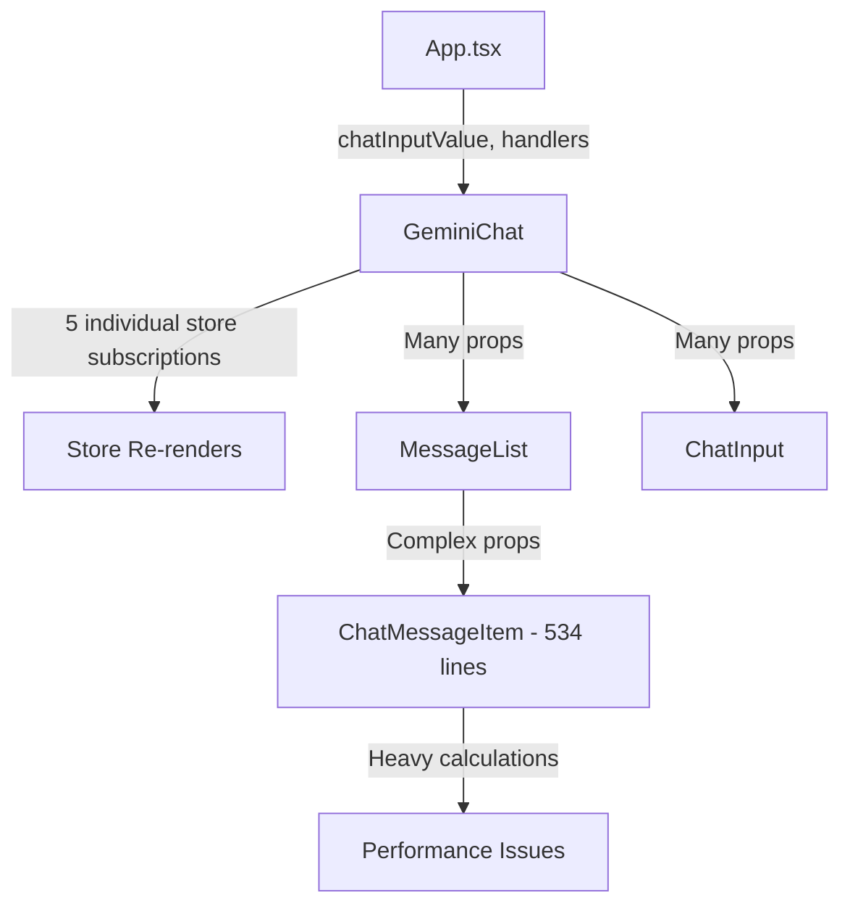

# GeminiChat Component Decomposition Architecture Plan

## Executive Summary

The [`src/features/chat/GeminiChat.tsx`](src/features/chat/GeminiChat.tsx:1) component requires architectural decomposition to address performance issues, reduce complexity, and improve testability. The current implementation suffers from multiple store subscriptions, prop drilling, and mixed concerns.

## Current State Analysis

### Component Size & Complexity Issues
- **GeminiChat**: 126 lines with 5 direct store subscriptions causing excessive re-renders
- **ChatMessageItem**: 534 lines - severely oversized with mixed responsibilities
- **useGeminiChat**: 199 lines with complex business logic that should be further separated
- **App.tsx**: Props drilling chatInputValue and handlers down to GeminiChat

### Performance Problems Identified
1. Multiple individual store subscriptions in GeminiChat (lines 27-36)
2. Non-memoized prop passing causing child re-renders
3. ChatMessageItem performing heavy calculations on every render
4. No virtualization for message lists despite potential for many messages
5. Expensive GSAP animations without proper cleanup patterns

### Current Data Flow Issues


## Target Architecture

### Proposed Component Tree
```
src/features/chat/
├── GeminiChatContainer.tsx          # Smart container component
├── GeminiChatPresenter.tsx          # Presentational component
├── components/
│   ├── ChatToolbar.tsx              # Screenshot, settings controls
│   ├── ChatMessageList.tsx          # Virtualized message list
│   ├── ChatInputContainer.tsx       # Input with local state management
│   ├── message-types/
│   │   ├── BaseMessage.tsx          # Common message wrapper
│   │   ├── TextMessage.tsx          # Regular text messages
│   │   ├── SystemMessage.tsx        # System notifications
│   │   ├── ChoiceMessage.tsx        # Choice prompts
│   │   ├── SourceSelectionMessage.tsx # OBS source selection
│   │   └── MessageActions.tsx       # Copy, regenerate, context buttons
│   └── ChatSuggestions.tsx          # Welcome suggestions
├── hooks/
│   ├── useChatContainerState.ts     # Combined store selectors
│   ├── useScreenshotCapture.ts      # Screenshot functionality
│   ├── useChatInputManager.ts       # Input state management
│   └── useMessageActions.ts         # Message action handlers
└── types/
    └── chatComponents.ts            # Component prop types
```

## Detailed Component Contracts

### 1. GeminiChatContainer (Smart Component)
```typescript
// New file: src/features/chat/GeminiChatContainer.tsx
interface GeminiChatContainerProps {
  onRefreshData: () => Promise<void>;
  setErrorMessage: (message: string | null) => void;
  onStreamerBotAction: (action: { type: string; args?: Record<string, unknown> }) => Promise<void>;
}

// Uses: useChatContainerState, useScreenshotCapture
// Responsibilities: Data fetching, business logic, error handling
```

### 2. GeminiChatPresenter (Presentational Component)
```typescript
// New file: src/features/chat/GeminiChatPresenter.tsx  
interface GeminiChatPresenterProps {
  messages: ChatMessage[];
  isLoading: boolean;
  chatState: ChatContainerState;
  onScreenshot: () => void;
  onSend: (message: string) => void;
  onSuggestionClick: (prompt: string) => void;
}

// Responsibilities: Layout, composition, prop distribution
// Performance: React.memo with shallow comparison
```

### 3. ChatMessageList (Virtualized List)
```typescript
// Enhanced: src/features/chat/MessageList.tsx
interface ChatMessageListProps {
  messages: ChatMessage[];
  isLoading: boolean;
  onSuggestionClick: (prompt: string) => void;
  onMessageAction: (action: MessageAction) => void;
  virtualizationEnabled: boolean; // For large message counts
}

// Uses: react-window or similar for virtualization when messages > 50
// Performance: React.memo, item-level memoization
```

### 4. Message Type Components

#### BaseMessage (Common Wrapper)
```typescript
// New file: src/features/chat/components/message-types/BaseMessage.tsx
interface BaseMessageProps {
  message: ChatMessage;
  children: ReactNode;
  onAction?: (action: MessageAction) => void;
  showActions?: boolean;
}

// Responsibilities: Common styling, action buttons, animations
```

#### TextMessage (Decomposed from ChatMessageItem)
```typescript
// New file: src/features/chat/components/message-types/TextMessage.tsx
interface TextMessageProps {
  message: ChatMessage;
  onAddToContext: (text: string) => void;
  onRegenerate: (messageId: string) => void;
}

// Responsibilities: Text rendering, SecureHtmlRenderer integration
// Performance: React.memo, memoized content processing
```

### 5. Custom Hooks

#### useChatContainerState (Optimized Selectors)
```typescript
// New file: src/features/chat/hooks/useChatContainerState.ts
interface ChatContainerState {
  // Combined state from multiple stores
  messages: ChatMessage[];
  isGeminiClientInitialized: boolean;
  isConnected: boolean;
  sources: OBSSource[];
  currentProgramScene: string | null;
  theme: ThemeSettings;
  actions: ChatActions;
}

// Replaces 5 individual subscriptions with 1 optimized selector
// Uses: useOptimizedStoreSelectors patterns
```

#### useScreenshotCapture
```typescript
// New file: src/features/chat/hooks/useScreenshotCapture.ts
interface UseScreenshotCapture {
  captureScreenshot: () => Promise<void>;
  isCapturing: boolean;
  error: string | null;
}

// Extracted from GeminiChat, standalone testable logic
```

#### useChatInputManager
```typescript
// New file: src/features/chat/hooks/useChatInputManager.ts
interface UseChatInputManager {
  inputValue: string;
  setInputValue: (value: string) => void;
  handleSend: () => void;
  useGoogleSearch: boolean;
  setUseGoogleSearch: (value: boolean) => void;
  isValid: boolean;
  error: string | undefined;
}

// Removes chatInputValue prop drilling from App level
// Local state management for input
```

## Performance Optimizations

### Memoization Strategy
1. **Component Level**: 
   - `React.memo` on all presentational components
   - Custom comparison functions for complex props
   - Memoized callback props using `useCallback`

2. **Hook Level**:
   - `useMemo` for expensive calculations
   - `useCallback` for event handlers
   - Optimized store selectors with shallow comparison

3. **Message List**:
   - Item-level memoization in message components
   - Virtualization for lists > 50 items
   - Lazy loading of message actions

### Store Optimization
```typescript
// Replace individual subscriptions:
const isConnected = useConnectionManagerStore((state: any) => state.isConnected);
const sources = useConnectionManagerStore((state: any) => state.sources);
const currentProgramScene = useConnectionManagerStore((state: any) => state.currentProgramScene);
const messages = useChatStore((state: any) => state.geminiMessages);
const isGeminiClientInitialized = useChatStore((state: any) => state.isGeminiClientInitialized);

// With single optimized selector:
const chatContainerState = useChatContainerState(); // 1 subscription
```

## Migration Plan (3 Sprints)

### Sprint 1: Foundation & Store Optimization
**Acceptance Criteria:**
- [ ] Create `useChatContainerState` hook combining all store subscriptions
- [ ] Extract `useScreenshotCapture` hook from GeminiChat
- [ ] Create `useChatInputManager` hook to eliminate prop drilling
- [ ] Update GeminiChat to use new hooks (reduce from 5 to 1 store subscription)
- [ ] Add performance monitoring to measure re-render reduction

**Files Modified:**
- [`src/features/chat/GeminiChat.tsx`](src/features/chat/GeminiChat.tsx:1) - Use new hooks
- [`src/App.tsx`](src/App.tsx:1) - Remove chatInputValue prop drilling
- New: `src/features/chat/hooks/useChatContainerState.ts`
- New: `src/features/chat/hooks/useScreenshotCapture.ts`  
- New: `src/features/chat/hooks/useChatInputManager.ts`

**Risk Level:** Low - Non-breaking hook extraction
**Rollback:** Revert to individual store subscriptions if issues arise

### Sprint 2: ChatMessageItem Decomposition
**Acceptance Criteria:**
- [ ] Create BaseMessage wrapper component
- [ ] Extract TextMessage, SystemMessage, ChoiceMessage components
- [ ] Create MessageActions component for buttons
- [ ] Reduce ChatMessageItem from 534 to <100 lines
- [ ] Add React.memo to all new message components
- [ ] Maintain existing functionality and styling

**Files Modified:**
- [`src/features/chat/ChatMessageItem.tsx`](src/features/chat/ChatMessageItem.tsx:1) - Decompose
- New: `src/features/chat/components/message-types/BaseMessage.tsx`
- New: `src/features/chat/components/message-types/TextMessage.tsx`
- New: `src/features/chat/components/message-types/SystemMessage.tsx`
- New: `src/features/chat/components/message-types/ChoiceMessage.tsx`
- New: `src/features/chat/components/message-types/SourceSelectionMessage.tsx`
- New: `src/features/chat/components/message-types/MessageActions.tsx`

**Risk Level:** Medium - Large component refactor
**Rollback:** Keep original ChatMessageItem as backup, feature flag new components

### Sprint 3: Container/Presenter Split & Polish
**Acceptance Criteria:**
- [ ] Split GeminiChat into Container and Presenter components
- [ ] Add virtualization to MessageList for performance
- [ ] Implement comprehensive error boundaries
- [ ] Add ChatToolbar component for screenshot/controls
- [ ] Complete performance optimization with React.memo
- [ ] Achieve <16ms render times for typical operations

**Files Modified:**
- [`src/features/chat/GeminiChat.tsx`](src/features/chat/GeminiChat.tsx:1) - Split into Container/Presenter
- [`src/features/chat/MessageList.tsx`](src/features/chat/MessageList.tsx:1) - Add virtualization
- New: `src/features/chat/GeminiChatContainer.tsx`
- New: `src/features/chat/GeminiChatPresenter.tsx`
- New: `src/features/chat/components/ChatToolbar.tsx`
- Updated: Error boundaries around chat components

**Risk Level:** Medium - Architectural changes
**Rollback:** Feature flag allowing fallback to monolithic component

## Testing Strategy

### Unit Tests
- **Hooks Testing**: Mock store states, test logic isolation
- **Component Testing**: Enzyme/Testing Library for isolated rendering
- **Message Components**: Test different message types and actions

### Integration Tests  
- **Chat Flow**: User types → message sent → response rendered
- **OBS Integration**: Screenshot capture, source selection
- **Error Handling**: Network failures, malformed responses

### Performance Tests
- **Render Performance**: Measure re-render frequency and duration
- **Memory Usage**: Monitor for leaks in long chat sessions
- **List Performance**: Test with 100+ messages

## Risk Analysis & Mitigation

### High Risk Areas
1. **ChatMessageItem