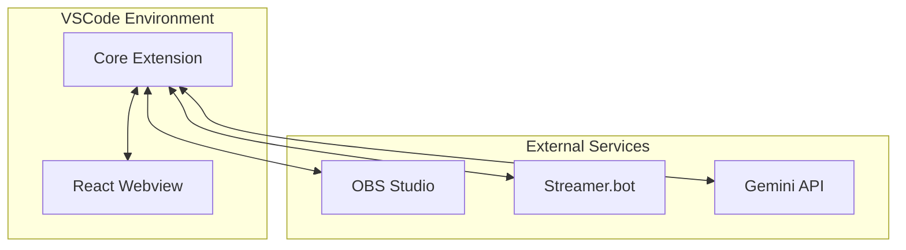

# OBS Copilot Architecture

## Overview
OBS Copilot is a VSCode extension that provides AI assistance for live streaming setups. It consists of:

1. **Core Extension**: TypeScript backend managing state and OBS connections
2. **Webview UI**: React-based interface for user interaction
3. **MCP Integration**: Model Context Protocol for external tool integration
4. **API Services**: Handlers for various media APIs (GIPHY, Unsplash, etc.)

## Key Components

## Data Flow
1. User interacts with Webview UI
2. Commands sent to Core Extension
3. Extension communicates with OBS/Streamer.bot
4. AI services process requests
5. Results displayed in Webview
