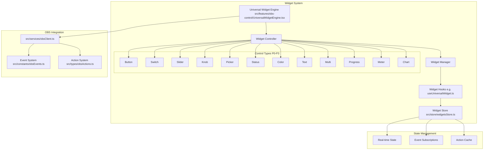
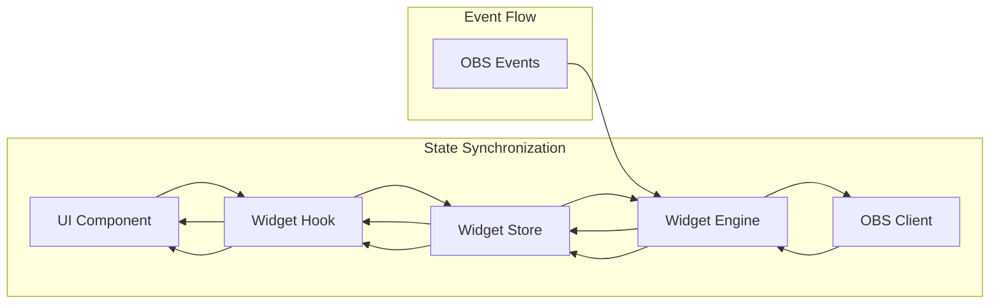
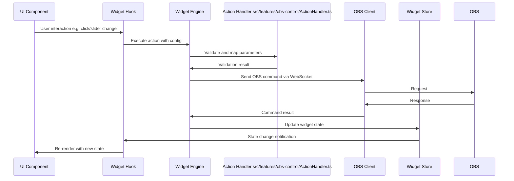

# Unified Implementation Plan for Universal OBS Widget System

## Executive Summary

This unified plan merges the two existing implementation strategies for the Universal OBS Widget System in the obs-copilot project. The goal is to expand the current limited system (supporting only `toggle_mute` and `switch_scene` actions with basic slider/knob controls) to a comprehensive framework handling 100+ OBS actions across 12+ control types, with real-time synchronization, advanced configuration, and performance optimizations. By resolving overlaps (e.g., core types and engine definitions), consolidating phases into 5 (from original 5 and 7), incorporating priority matrices, updated architecture diagrams, and risk assessments, this plan provides a cohesive 6-week roadmap. It aligns with project conventions: leveraging `src/services/obsClient.ts` for OBS integration, Zustand stores (e.g., enhance `src/store/widgetsStore.ts`), TypeScript types in `src/types/`, UI primitives in `src/components/ui/`, and Tailwind for styling. No implementation occurs here; this is purely the planning document.

## Current State Analysis

### Existing Limitations
- Limited to 2 actions (`toggle_mute`, `switch_scene`) and basic controls (sliders/knobs for volume/gain).
- No real-time feedback or event subscriptions; widgets are stateless.
- Basic configuration without templates, auto-discovery, or advanced features like grouping/dashboards.
- Existing files: `src/features/obs-control/` includes `KnobWidget.tsx`, `ActionHandler.ts`, `widgetStore.ts`; OBS integration via `src/services/obsClient.ts` and `src/constants/obsEvents.ts`; state in `src/store/`.

### Available Capabilities
- 100+ actions defined in `src/types/obsActions.ts` (inferred from project structure).
- 88+ events in `src/constants/obsEvents.ts`.
- WebSocket v5 integration ready in `src/services/obsClient.ts`.
- Zustand for global state (extend `src/store/widgetsStore.ts` or `src/store/connectionsStore.ts`).

### Overlaps and Duplications from Original Plans
- **Core Types/Engine**: Both specify `src/types/universalWidget.ts`, `UniversalWidgetEngine.tsx`, hooks like `useUniversalWidget.ts`.
- **Controls**: Common P0 types (Button, Switch, Knob, Slider); second plan adds Picker, Status, etc.
- **Actions/Events**: Both cover mapping (`actionMapper.ts`), subscriptions (`eventSubscriptionManager.ts`), reactions.
- **Config/Templates**: Overlapping modals (`UniversalWidgetConfigModal.tsx`), templates (e.g., audio/scene).
- **Advanced/Testing**: Dashboards, themes, optimization, tests in both; second plan adds priority matrix and risks.

### Resolved Conflicts
- Phase Structure: Merged into 5 phases (Core Infrastructure, Controls, Actions/Events & Advanced Types, Config/Templates & Dashboard, Testing/Optimization) over 6 weeks.
- Prioritization: Adopt second plan's matrix, emphasizing P0 (Button/Switch/Slider) for high-impact/low-effort.
- Diagrams: Updated Mermaid graphs to consolidate architectures.
- Timeline: Unified to 6 weeks, blending weekly checklists.

## Target Architecture

### Core Components Overview
The architecture centralizes logic in services, uses Zustand for state, and composes UI from primitives. Key flow: UI → Hooks → Store → Engine → OBS Client.

### State Flow
Bidirectional sync between UI, store, and OBS.

### Action Execution Sequence
User interaction triggers validated OBS commands with state updates.

## Unified Phases

### Phase 1: Core Infrastructure (Weeks 1-2)
Focus: Foundation types, engine, and basic store enhancements. Builds on overlaps in core types/engine.

**Key Files/Modifications:**
- `src/types/universalWidget.ts` - Core interfaces (UniversalWidgetConfig, WidgetControlType, etc.)
- `src/types/widgetActions.ts` - Action mappings
- `src/types/widgetEvents.ts` - Event types
- `src/features/obs-control/UniversalWidgetEngine.tsx` - Rendering and logic engine
- `src/features/obs-control/hooks/useUniversalWidget.ts` - Widget logic hook
- `src/services/universalWidgetService.ts` - Business logic
- Enhance `src/store/widgetsStore.ts` - Add real-time state, subscriptions, caching

**Key Features:**
- Dynamic rendering, validation, event management, value conversion.
- Integration with existing `obsClient.ts`.

**Timeline:**
- Week 1: Types and engine prototype.
- Week 2: Hooks, service, store enhancements; basic testing.

### Phase 2: Control Widgets Implementation (Weeks 2-3)
Focus: P0-P1 controls (Button, Switch, Slider, Knob, Picker, Status). Prioritize high-impact basics.

**Key Files:**
- `src/features/obs-control/controls/UniversalButton.tsx`
- `src/features/obs-control/controls/UniversalSwitch.tsx`
- `src/features/obs-control/controls/UniversalSlider.tsx` (enhance existing)
- `src/features/obs-control/controls/UniversalKnob.tsx` (enhance existing)
- `src/features/obs-control/controls/UniversalPicker.tsx`
- `src/features/obs-control/controls/UniversalStatus.tsx`
- `src/features/obs-control/BaseWidget.tsx` - Common base

**Key Features:**
- Interaction handling, state sync, styling with Tailwind/UI primitives.
- P0 emphasis: Button/Switch/Slider for immediate value.

**Timeline:**
- Week 2: P0 controls (Button/Switch/Slider).
- Week 3: P1 (Knob/Picker/Status); integration tests.

### Phase 3: Actions, Events, and Advanced Types (Weeks 3-4)
Focus: Merge action/event systems with advanced controls (Stepper, Color, Text, Multi, Progress, Meter, Chart).

**Key Files:**
- `src/services/actionMapper.ts` - OBS command mapping
- `src/services/parameterValidator.ts` / `valueConverter.ts`
- `src/services/eventSubscriptionManager.ts` - Subscriptions/sync
- `src/services/stateSynchronizer.ts` / `conflictResolver.ts`
- `src/services/reactionEngine.ts` - Reactions/sequences
- Advanced controls: `UniversalStepper.tsx`, `UniversalColor.tsx`, etc.

**Key Features:**
- 100+ actions support, bidirectional sync, conflict resolution.
- Audio/scene/source-specific advanced types.

**Timeline:**
- Week 3: Core actions/events.
- Week 4: Advanced controls, reactions; performance throttling.

### Phase 4: Configuration, Templates, and Dashboard (Weeks 4-5)
Focus: Config UI, templates, auto-discovery, grouping/dashboards, theming.

**Key Files:**
- `src/plugins/core/UniversalWidgetConfigModal.tsx`
- `src/features/obs-control/WidgetTemplateSelector.tsx` / `ActionParameterMapper.tsx`
- Config templates: `src/config/widgetTemplates/audio.ts`, etc.
- `src/services/targetDiscovery.ts` / `actionDiscovery.ts`
- `src/features/obs-control/WidgetDashboard.tsx` / `WidgetGroup.tsx`
- `src/features/obs-control/WidgetThemeProvider.tsx`

**Key Features:**
- Smart templates (audio/scene/streaming), auto-discovery, drag-and-drop.
- Theming, conditional logic, multi-dashboard.

**Timeline:**
- Week 4: Config modals, templates, discovery.
- Week 5: Dashboard, grouping, theming; user testing.

### Phase 5: Testing, Optimization, and Validation (Weeks 5-6)
Focus: Comprehensive testing, performance, error handling.

**Key Files:**
- Tests: `src/features/obs-control/__tests__/UniversalWidget.test.tsx`, etc.
- `src/services/widgetOptimizer.ts` / `renderCache.ts` / `eventThrottler.ts`
- `src/services/widgetValidator.ts` / `errorHandler.ts`
- `src/features/obs-control/WidgetErrorBoundary.tsx`

**Key Features:**
- Unit/integration/stress tests, validation, graceful errors.
- Optimization: Batching, memoization, monitoring.

**Timeline:**
- Week 5: Testing framework, initial optimizations.
- Week 6: Full validation, documentation, deployment prep.

## Technical Decisions

- **Architecture**: Modular (services for logic, hooks for UI, Zustand for state); composition over inheritance.
- **Integration**: Extend `obsClient.ts` for all actions/events; use Vite aliases for imports.
- **State**: Local for UI, global Zustand for sync; cache to reduce API calls.
- **Performance**: Lazy loading, throttling, memoization; no hardcoding (use VITE_ env).
- **UI/Styling**: Tailwind + `src/components/ui/` primitives; type-safe with `src/types/`.
- **Backward Compatibility**: Gradual migration of existing widgets (e.g., Knob/Slider).

## Priority Matrix

| Priority | Widget Type | Impact | Effort | Examples |
|----------|-------------|--------|--------|----------|
| P0 | Button, Switch, Slider | High | Low-Medium | Streaming start/stop, mute, volume |
| P1 | Knob, Picker, Status | High | Medium | Audio gain, scene selection, connection status |
| P2 | Stepper, Color, Text, Multi, Progress | Medium | Medium-High | Position adjust, source color, rename, presets, recording progress |
| P3 | Meter, Chart | Low | High | Audio levels, performance trends |

Prioritize P0 for MVP; implement in Phase 2.

## Risk Assessment

### Technical Risks
1. **Performance**: Many widgets causing lag → Mitigate: Throttling, virtualization (Phase 5).
2. **Sync Issues**: State desync with OBS → Mitigate: Event-driven updates, retries (Phase 3).
3. **Connection Drops**: WebSocket instability → Mitigate: Auto-reconnect in `obsClient.ts` (Phase 1).
4. **Complexity**: Overly modular code → Mitigate: Clear docs, modular tests (Phase 5).

### Implementation Risks
1. **Breaking Existing**: Legacy widgets fail → Mitigate: Compatibility layer (Phase 1).
2. **Scope Creep**: Adding unprioritized features → Mitigate: Strict phase adherence, P0 focus.
3. **Testing Gaps**: Untested combinations → Mitigate: Comprehensive coverage, beta tests (Phase 5).

## Success Metrics

### Performance
- Render time <16ms (95% widgets); action response <100ms.
- Memory <50MB (100 widgets); CPU <5% idle.

### Functionality
- Support 100+ actions, 12+ controls; 95% test coverage.
- Configuration time <30s/widget; error rate <1%.

### Adoption
- User satisfaction >4.5/5; template usage tracked.
- Bug reports <5/week post-launch.

## Next Steps
1. Review/approve this unified plan.
2. Switch to Code mode for Phase 1 implementation.
3. Set up testing environment.
4. Prototype core types/engine.
5. Monitor progress against timeline.