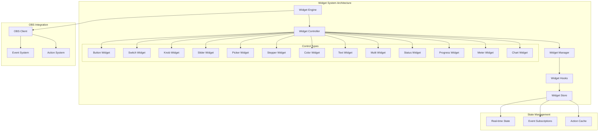
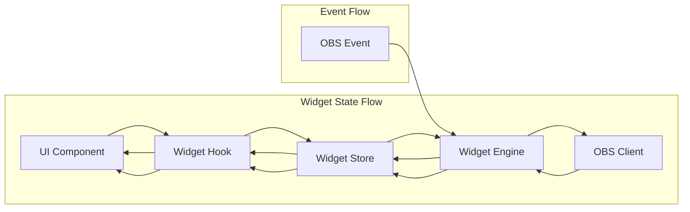
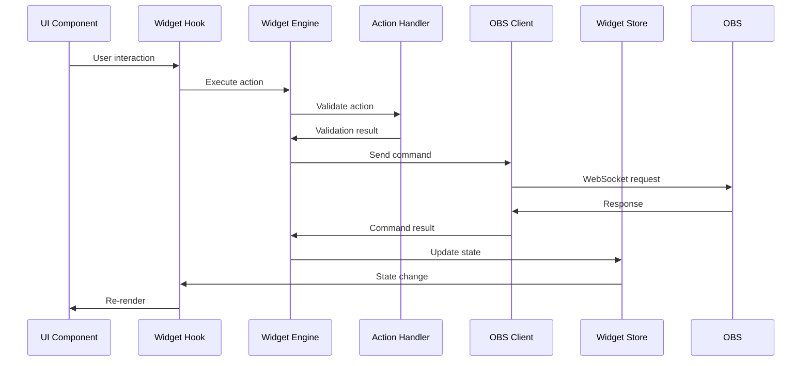

# Universal OBS Widget System - Implementation Plan

## Executive Summary

This document outlines the implementation strategy for transforming the current limited OBS widget system (2 actions: `toggle_mute`, `switch_scene`) into a comprehensive universal widget system that supports all 100+ OBS websocket commands with 12+ different control types, real-time state synchronization, and advanced configuration options.

## Current State Analysis

### Existing System Limitations
- **Only 2 action types**: `toggle_mute` and `switch_scene`
- **Limited control types**: Only slider/knob controls for volume/gain
- **No real-time feedback**: Widgets don't update when OBS state changes
- **Basic configuration**: Simple modal with limited options
- **No event subscriptions**: Widgets are stateless and don't respond to OBS events

### Protocol Capabilities Available
- **100+ action types** in [`src/types/obsActions.ts`](src/types/obsActions.ts)
- **88+ event types** in [`src/constants/obsEvents.ts`](src/constants/obsEvents.ts)
- **Comprehensive websocket integration** via [`src/services/obsClient.ts`](src/services/obsClient.ts)

## Target Architecture

### Core Components

### Widget Control Types

| Control Type | Use Case | OBS Examples |
|--------------|----------|--------------|
| **Button** | Execute actions | Start/stop streaming, scene switching, source toggling |
| **Switch** | Boolean controls | Mute/unmute, visibility toggle, enable/disable |
| **Knob** | Continuous rotary controls | Volume, gain, opacity, rotation |
| **Slider** | Linear continuous controls | Volume, brightness, contrast, position |
| **Picker** | Selection controls | Scene selection, transition selection, profile selection |
| **Stepper** | Increment/decrement controls | Move source position, adjust values |
| **Color** | Color selection | Source color, background color, filter color |
| **Text** | Text input | Rename scenes, set text sources, custom commands |
| **Multi** | Button groups | Quick scene switching, preset buttons |
| **Status** | Read-only displays | Connection status, streaming stats, recording time |
| **Progress** | Progress indicators | Recording progress, upload progress |
| **Meter** | Analog displays | Audio levels, CPU usage, network stats |
| **Chart** | Data visualization | Stream stats over time, performance metrics |

## Implementation Phases

### Phase 1: Core Infrastructure (Week 1-2)

#### 1.1 Universal Widget Engine
- **Create**: [`src/features/obs-control/UniversalWidgetEngine.ts`](src/features/obs-control/UniversalWidgetEngine.ts)
- **Purpose**: Central engine to manage all widget operations
- **Key Features**:
  - Action execution system
  - Event subscription management
  - State synchronization
  - Performance optimization
  - Error handling and recovery

#### 1.2 Widget Store Enhancement
- **Enhance**: [`src/store/widgetsStore.ts`](src/store/widgetsStore.ts)
- **Add Features**:
  - Real-time state management
  - Event subscription tracking
  - Action caching and batching
  - Performance metrics
  - Widget lifecycle management

#### 1.3 Action Handler System
- **Create**: [`src/features/obs-control/ActionHandler.ts`](src/features/obs-control/ActionHandler.ts)
- **Purpose**: Universal action execution system
- **Features**:
  - Dynamic action validation
  - Parameter mapping
  - Error handling
  - Retry logic
  - Action sequencing

### Phase 2: Control Widget Implementation (Week 2-3)

#### 2.1 Base Widget Components
- **Create**: [`src/features/obs-control/BaseWidget.tsx`](src/features/obs-control/BaseWidget.tsx)
- **Features**:
  - Common widget functionality
  - Event subscription management
  - State synchronization
  - Error boundary integration
  - Performance optimization

#### 2.2 Control-Specific Components
- **Button Widget**: [`src/features/obs-control/ButtonWidget.tsx`](src/features/obs-control/ButtonWidget.tsx)
- **Switch Widget**: [`src/features/obs-control/SwitchWidget.tsx`](src/features/obs-control/SwitchWidget.tsx)
- **Knob Widget**: [`src/features/obs-control/KnobWidget.tsx`](src/features/obs-control/KnobWidget.tsx) (enhance existing)
- **Slider Widget**: [`src/features/obs-control/SliderWidget.tsx`](src/features/obs-control/SliderWidget.tsx) (enhance existing)
- **Picker Widget**: [`src/features/obs-control/PickerWidget.tsx`](src/features/obs-control/PickerWidget.tsx)
- **Status Widget**: [`src/features/obs-control/StatusWidget.tsx`](src/features/obs-control/StatusWidget.tsx)

### Phase 3: Advanced Widget Types (Week 3-4)

#### 3.1 Audio Control Widgets
- **Volume Control**: Advanced volume with mute, balance, sync offset
- **Audio Monitor**: Real-time audio level meters
- **Audio Mixer**: Multi-channel mixing controls
- **Filter Controls**: Audio filter parameters

#### 3.2 Scene Management Widgets
- **Scene Switcher**: Quick scene switching with previews
- **Scene Creator**: Create new scenes with templates
- **Scene Organizer**: Drag-and-drop scene management
- **Transition Controls**: Transition settings and overrides

#### 3.3 Source Property Widgets
- **Transform Controls**: Position, scale, rotation, crop
- **Visibility Controls**: Source visibility with animations
- **Filter Management**: Add/remove/configure filters
- **Source Settings**: Advanced source-specific properties

### Phase 4: Output Monitoring (Week 4-5)

#### 4.1 Streaming Widgets
- **Stream Status**: Connection status, bitrate, viewers
- **Stream Stats**: Real-time streaming statistics
- **Stream Controls**: Start/stop streaming with confirmation
- **Stream Health**: Connection quality, dropped frames

#### 4.2 Recording Widgets
- **Recording Status**: Recording state, duration, file size
- **Recording Controls**: Start/stop/pause recording
- **Recording Stats**: Bitrate, file format, disk space
- **Recording Manager**: Multiple recording sessions

#### 4.3 Performance Monitoring
- **System Stats**: CPU, memory, GPU usage
- **OBS Performance**: Render time, frame rate
- **Network Stats**: Bandwidth usage, connection quality
- **Performance Charts**: Historical performance data

### Phase 5: Configuration & Templates (Week 5-6)

#### 5.1 Enhanced Configuration System
- **Universal Config Modal**: [`src/plugins/core/UniversalWidgetConfigModal.tsx`](src/plugins/core/UniversalWidgetConfigModal.tsx)
- **Template System**: Pre-configured widget templates
- **Widget Library**: Browse and import widget configurations
- **Import/Export**: Share widget configurations

#### 5.2 Widget Templates
- **Audio Templates**: Volume controls, mixer panels, filter banks
- **Scene Templates**: Scene switchers, transition controls
- **Stream Templates**: Stream controls, status displays
- **Custom Templates**: User-created template sharing

#### 5.3 Advanced Configuration
- **Conditional Logic**: Show/hide widgets based on conditions
- **Action Sequences**: Complex multi-action workflows
- **Event Reactions**: Widget responses to OBS events
- **Performance Optimization**: Throttling, debouncing, caching

### Phase 6: Dashboard & Layout (Week 6-7)

#### 6.1 Dashboard System
- **Widget Dashboard**: [`src/features/obs-control/WidgetDashboard.tsx`](src/features/obs-control/WidgetDashboard.tsx)
- **Layout Management**: Grid, flex, absolute positioning
- **Responsive Design**: Mobile-friendly layouts
- **Multi-Dashboard Support**: Multiple dashboard configurations

#### 6.2 Widget Grouping
- **Widget Groups**: Logical grouping of related widgets
- **Tab System**: Organize widgets in tabs
- **Collapsible Panels**: Expandable/collapsible widget groups
- **Widget Stacking**: Overlay and stack widgets

#### 6.3 Theming & Customization
- **Theme System**: Light/dark themes with custom colors
- **Widget Styling**: Individual widget appearance customization
- **Layout Themes**: Pre-built dashboard layouts
- **Custom CSS**: Advanced styling options

### Phase 7: Testing & Optimization (Week 7-8)

#### 7.1 Testing Framework
- **Unit Tests**: Component and utility testing
- **Integration Tests**: OBS websocket integration testing
- **Performance Tests**: Widget performance benchmarking
- **User Testing**: Beta testing with real users

#### 7.2 Performance Optimization
- **Render Optimization**: Virtual scrolling, memoization
- **Network Optimization**: Request batching, caching
- **Memory Management**: Cleanup and garbage collection
- **Bundle Optimization**: Code splitting, lazy loading

#### 7.3 Error Handling & Recovery
- **Error Boundaries**: Component-level error handling
- **Connection Recovery**: Automatic reconnection logic
- **Data Validation**: Input validation and sanitization
- **User Feedback**: Clear error messages and recovery options

## Technical Architecture

### State Management Architecture

### Action Execution Flow

## Implementation Priority Matrix

| Priority | Widget Type | Impact | Effort | Examples |
|----------|-------------|---------|---------|----------|
| **P0** | Button | High | Low | Start/stop streaming, scene switching |
| **P0** | Switch | High | Low | Mute/unmute, visibility toggle |
| **P0** | Slider | High | Medium | Volume, gain, opacity |
| **P1** | Status | High | Medium | Connection status, stream stats |
| **P1** | Picker | Medium | Medium | Scene selection, transition selection |
| **P1** | Knob | Medium | Medium | Audio controls, filter parameters |
| **P2** | Multi | Medium | High | Quick scene buttons, preset controls |
| **P2** | Progress | Low | Medium | Recording progress, upload status |
| **P2** | Meter | Low | High | Audio levels, performance metrics |
| **P3** | Chart | Low | High | Historical data, performance trends |

## Risk Assessment & Mitigation

### Technical Risks

1. **Performance Impact**
   - **Risk**: Too many widgets causing UI lag
   - **Mitigation**: Virtual scrolling, memoization, throttling

2. **Memory Leaks**
   - **Risk**: Event subscriptions not properly cleaned up
   - **Mitigation**: Strict cleanup protocols, memory monitoring

3. **Connection Stability**
   - **Risk**: WebSocket connection drops affecting all widgets
   - **Mitigation**: Automatic reconnection, connection pooling

4. **State Synchronization**
   - **Risk**: Widget state getting out of sync with OBS
   - **Mitigation**: Event-driven updates, periodic state refresh

### Implementation Risks

1. **Breaking Changes**
   - **Risk**: Existing widgets stop working
   - **Mitigation**: Backward compatibility, gradual migration

2. **Complexity Management**
   - **Risk**: System becomes too complex to maintain
   - **Mitigation**: Modular architecture, clear documentation

3. **Testing Coverage**
   - **Risk**: Insufficient testing of all widget combinations
   - **Mitigation**: Automated testing, beta testing program

## Success Metrics

### Performance Metrics
- **Widget Render Time**: < 16ms for 95% of widgets
- **Action Response Time**: < 100ms for 95% of actions
- **Memory Usage**: < 50MB for 100 widgets
- **CPU Usage**: < 5% for idle widgets

### User Experience Metrics
- **Widget Configuration Time**: < 30 seconds for new widget
- **Dashboard Load Time**: < 2 seconds for 50 widgets
- **Error Rate**: < 1% for widget operations
- **User Satisfaction**: > 4.5/5 rating

### Adoption Metrics
- **Widget Usage**: Track usage of different widget types
- **Template Downloads**: Popular template usage
- **Feature Requests**: User-requested widget types
- **Bug Reports**: Issues per widget type

## Conclusion

This implementation plan provides a comprehensive roadmap for transforming the current limited OBS widget system into a universal, powerful, and user-friendly widget platform. The phased approach ensures steady progress while maintaining system stability and user experience.

The universal widget system will enable users to create sophisticated OBS control interfaces with real-time feedback, advanced configuration options, and professional-grade performance monitoring capabilities.

## Next Steps

1. **Review and approve** this implementation plan
2. **Switch to Code mode** to begin Phase 1 implementation
3. **Set up development environment** with proper testing infrastructure
4. **Create initial prototypes** for core components
5. **Establish testing protocols** and performance benchmarks

The foundation is now in place to build the most comprehensive OBS widget system available, bridging the gap between the current limited implementation and the full power of the OBS websocket protocol.